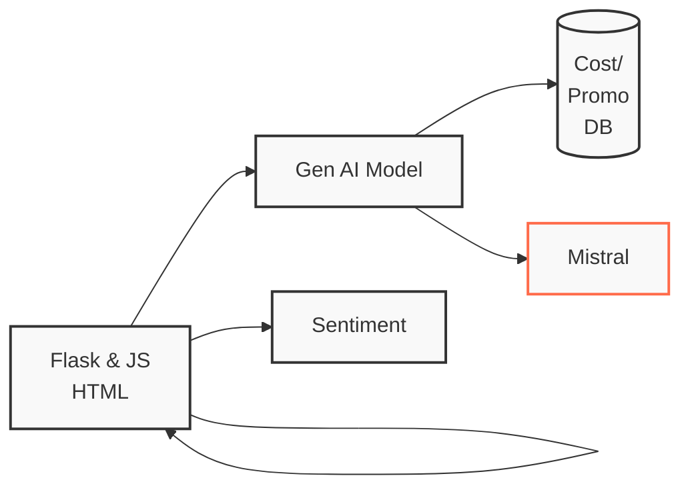

# Call Center Demo

A demonstration project showcasing a secure, air-gapped call center solution powered by Cloudera Machine Learning (CML). This project demonstrates how to implement an intelligent call center system that operates entirely within your secured environment, leveraging open-source LLM capabilities while maintaining complete data sovereignty and security.

## Architecture



The architecture demonstrates the system's key components:
- A Flask/JavaScript frontend that handles user interactions
- Integration with a Generative AI model
- Connection to Cost/Promo database for business logic
- Mistral LLM integration for advanced language processing
- Sentiment analysis capabilities
- Agent-like behavior mirroring through the frontend

## Key Features

- Call routing and queue management
- Agent dashboard for handling customer interactions
- Real-time analytics and reporting
- Customer interaction history
- Integration with locally-deployed open-source LLM
- Automated call distribution (ACD)

## Security Highlights

- **Complete Air-Gapped Operation**: Runs entirely within Cloudera Machine Learning environment
- **Zero External API Calls**: All LLM functionality is self-contained
- **Data Sovereignty**: All data and model operations remain within your secured infrastructure
- **Enterprise-Grade Security**: Leverages Cloudera's robust security framework

## Technology Stack

- Frontend: HTML, JavaScript
- Backend: Flask (Python) via webapp.py
- AI Component: 
  - Deployed in Cloudera Machine Learning
  - Utilizes open-source LLM model
  - Implemented in `ai_mistral.py`

## Project Structure

- `webapp.py`: Flask application server
- `ai_mistral.py`: CML-deployed model interface
- `static/`: Frontend assets and JavaScript files
- `templates/`: Flask HTML templates

## Prerequisites

- Cloudera Machine Learning (CML) environment
- Python 3.x
- Flask
- Access to CML Model Deployment capabilities

## Setup and Installation

```bash
# Clone the repository
git clone https://github.com/odog96/call-center-demo.git

# Navigate to project directory
cd call-center-demo

# Install Python dependencies
pip install -r requirements.txt
```

## Deployment

1. Deploy the LLM model using Cloudera Machine Learning
2. Configure the environment variables in CML
3. Deploy the Flask application
4. Access through your secured internal network

## Documentation

For detailed documentation about:
- CML deployment steps
- Security configuration
- API endpoints
- Frontend functionality

Please refer to the documentation in the project files.

## Contributing

Contributions are welcome! Please feel free to submit pull requests.

## License

This project is licensed under the MIT License - see the [LICENSE](LICENSE) file for details.